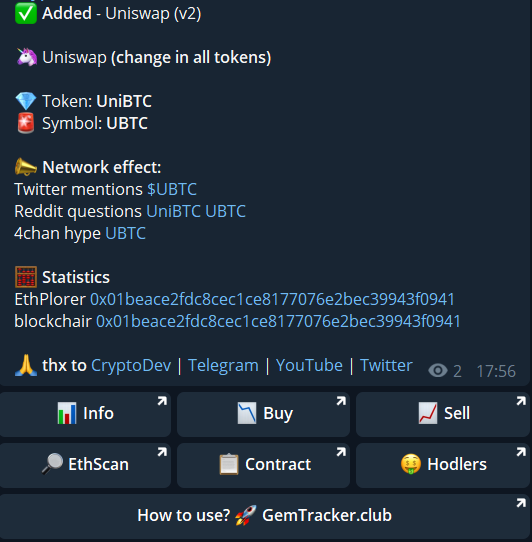

## Welcome to GemTracker.club

Instant notification about changes on [Uniswap](https://uniswap.org/) and other decentralized exchanges (DEX). Tracking whales movements and token transfers between addresses.

Join the secret channel on [Telegram](tg://join?invite=AAAAAFVYFw5YfpnyAUPhEg) and receive information about newly added and deleted tokens, potentially **gems**.

**Channel address will be released soon.**

### Features

#### *Implemented*:

##### Send message to private Telegram channel about:

- [x] recently added tokens to Uniswap (maybe gem?)
- [x] recently deleted tokens from Uniswap (maybe fake or scam or maybe poor liquidity)

#### *On roadmap:*

##### Send message to private Telegram channel about:

- [ ] recently added/deleted tokens to [Kyber Network](https://developer.kyber.network/docs/API_ABI-RESTfulAPI/#currencies)
- [ ] recently added/deleted tokens to [1inch](https://api.1inch.exchange/v1.1/tokens)
- [ ] recently added/deleted tokens to [loopring](https://docs.loopring.io/en/dex_apis/getTokens.html)
- [ ] recently added/deleted tokens to [IDEX](https://docs.idex.market/#operation/returnCurrencies)

##### Other:

- [ ] track [whales](https://captainaltcoin.com/what-are-crypto-whales/) address and send messages on changes ([when they are buying or selling](https://github.com/EverexIO/Ethplorer/wiki/Ethplorer-API#get-address-info))
- [ ] track token [transfers](https://github.com/EverexIO/Ethplorer/wiki/Ethplorer-API#get-token-info)
- [ ] track token [holders](https://github.com/EverexIO/Ethplorer/wiki/Ethplorer-API#get-token-info)
- [ ] track [top token holders](https://github.com/EverexIO/Ethplorer/wiki/Ethplorer-API#get-top-token-holders)
- [ ] your ideas post [here](https://github.com/CryptoDevTV/GemTracker/issues)

### Screens

### Author

Feel free to say thanks to [Tomasz Kowalczyk](https://twitter.com/tomkowalczyk) and...

- give him a subscribe on [YouTube](https://www.youtube.com/channel/UCDAgUeYcYhnhRaK2MAQGLbw?sub_confirmation=1)
- follow on [Twitter](https://twitter.com/tomkowalczyk)

